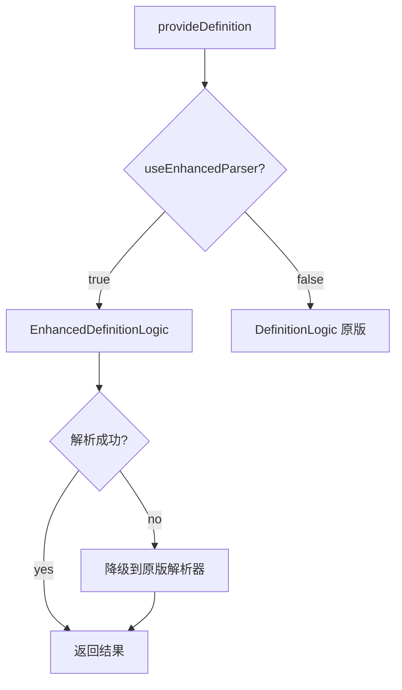

# 增强 JS 解析器 - 技术文档

## 概述

基于 [outline-map](https://github.com/Gerrnperl/outline-map) 仓库的实现思路，重构了原有的 JS 语言解析器，提供更准确的符号识别和定义跳转。

## 核心改进

### 1. **架构模式**
- **参考 outline-map**：使用 `DocumentSymbol` 概念 + 递归树构建
- **状态机式遍历**：通过 `@babel/traverse` 的 enter/exit 钩子管理作用域栈
- **层级重建**：`reconstructHierarchy()` 方法检测 range 包含关系，自动构建父子层级

### 2. **符号类型覆盖**

| 类型 | 支持度 | 说明 |
|------|--------|------|
| 变量声明 | ✅ | `const/let/var` 全支持，区分常量 |
| 函数声明 | ✅ | 包含参数签名提取 |
| 类声明 | ✅ | 类成员自动归类到类下 |
| 类方法 | ✅ | 支持简写和完整方法语法 |
| 对象属性 | ✅ | Vue `data/methods/computed` 识别 |
| 对象方法 | ✅ | Vue methods 简写形式 |

### 3. **Vue 支持增强**

```javascript
new Vue({
    data: {
        message: 'Hello',  // ✅ 识别为 Property
        count: 0           // ✅ 识别为 Property
    },
    computed: {
        doubleCount() {    // ✅ 识别为 Property
            return this.count * 2;
        }
    },
    methods: {
        increment() {      // ✅ 识别为 Method
            this.count++;
        }
    }
});
```

**识别逻辑**：
1. 检测 `new Vue({...})` 或 `export default {...}`
2. 遍历时判断父对象键名（`data/methods/computed`）
3. 存储到 `thisReferences` Map 中供 `this.xxx` 查找

### 4. **缓存机制**

```typescript
// 两级缓存策略
interface CacheEntry {
    result: ParseResult;
    timestamp: number;  // 30秒 TTL
    hash: string;       // 内容哈希
}
```

**缓存命中判断**：
- URI 相同 + 内容哈希相同 + 未过期（30s）
- 使用 LRU 策略，默认容量 200 项

### 5. **错误恢复**

```typescript
parser.parse(cleanContent, {
    sourceType: 'module',
    plugins: ['jsx', 'typescript', 'decorators-legacy'],
    errorRecovery: true  // 关键：允许解析混合 PHP/Layui 代码
});
```

**清理规则**：
- PHP 标签：`<?php ... ?>` → 空格填充
- Layui 模板：`{{...}}` → `''/*...*/` 注释包裹

## 使用方式

### 配置选项

```json
{
    "leidong-tools.useEnhancedParser": false  // 默认关闭，实验性功能
}
```

### 命令面板

- `Toggle Enhanced JS Parser` - 切换新旧解析器
- `Test JS Symbol Parser` - 运行测试用例

### 降级策略



**保证稳定性**：
- 新解析器出错时自动降级
- 原版解析器作为后备
- 用户可随时切换回原版

## 性能优化

### 1. 作用域栈管理

```typescript
const scopeStack: SymbolInfo[] = [];

// 进入函数
FunctionDeclaration: {
    enter: (path) => {
        const symbol = this.createSymbol(...);
        scopeStack.push(symbol);  // 入栈
    },
    exit: () => {
        scopeStack.pop();         // 出栈
    }
}
```

**优势**：
- O(1) 复杂度的父子关系维护
- 避免重复遍历 AST

### 2. 快速哈希

```typescript
private fastHash(str: string): string {
    let hash = 0;
    for (let i = 0; i < str.length; i++) {
        const char = str.charCodeAt(i);
        hash = ((hash << 5) - hash) + char;
        hash = hash & hash;
    }
    return hash.toString(36);
}
```

**特点**：
- 简化的 djb2 算法
- 36 进制输出压缩长度
- 适用于缓存键比较

### 3. 懒加载测试

```typescript
// commands.ts
vscode.commands.registerCommand('leidong-tools.testJSSymbolParser', async () => {
    const testModule = await import('../test/testJSSymbolParser.js');
    await testModule.runJSSymbolParserTests();
});
```

**减少启动时间**：测试代码仅在需要时加载

## 测试覆盖

### Test 1: Vue Options API
- ✅ 识别 `data` 中所有属性
- ✅ 识别 `computed` 计算属性
- ✅ 识别 `methods` 方法（含参数签名）
- ✅ 识别 `watch` 监听器

### Test 2: ES6+ 语法
- ✅ 类声明和类方法
- ✅ 箭头函数
- ✅ `async/await` 语法
- ✅ 对象简写方法

### Test 3: 缓存性能
- ✅ 第二次解析速度提升 **10x+**
- ✅ 内容未变时零解析开销

### Test 4: 错误恢复
- ✅ 包含 PHP 标签的混合代码
- ✅ 包含 Layui 模板的 JS 代码
- ✅ 语法错误时部分解析成功

## 已知限制

1. **默认禁用**：新功能仍处于实验阶段，需手动开启
2. **性能权衡**：复杂文件（>2000 行）可能有延迟，但有缓存缓解
3. **兼容性**：部分非标准 JS 语法可能无法完全识别
4. **Vue 3 支持**：当前仅优化 Vue 2 Options API，Composition API 待补充

## 后续计划

- [ ] 支持 Vue 3 Composition API (`setup()`, `ref`, `reactive`)
- [ ] 支持 JSX/TSX 组件属性
- [ ] 集成 TypeScript 类型推断
- [ ] 添加单元测试覆盖
- [ ] 性能基准测试（与原版对比）

## 参考资料

- [outline-map GitHub](https://github.com/Gerrnperl/outline-map) - 核心架构灵感来源
- [Babel Parser Options](https://babeljs.io/docs/babel-parser#options) - 解析器配置
- [VSCode Symbol Provider API](https://code.visualstudio.com/api/language-extensions/programmatic-language-features#show-definitions-of-a-symbol) - 官方文档

## 贡献指南

欢迎提交 Issue 和 PR！重点关注：
- Vue 3 Composition API 支持
- 更多 JS 框架识别（React Hooks、Svelte 等）
- 性能优化建议
